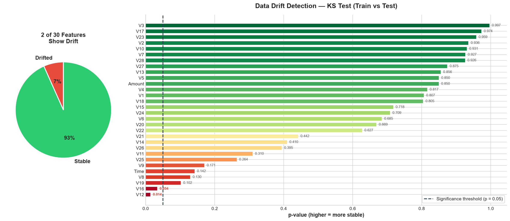
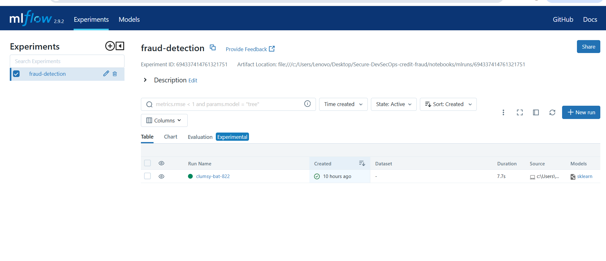
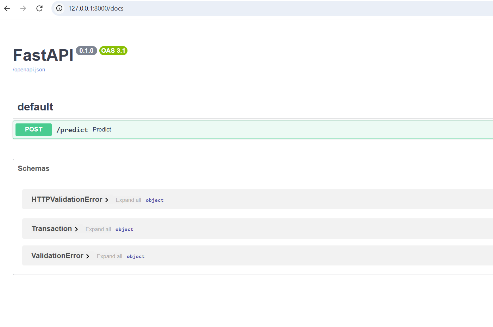
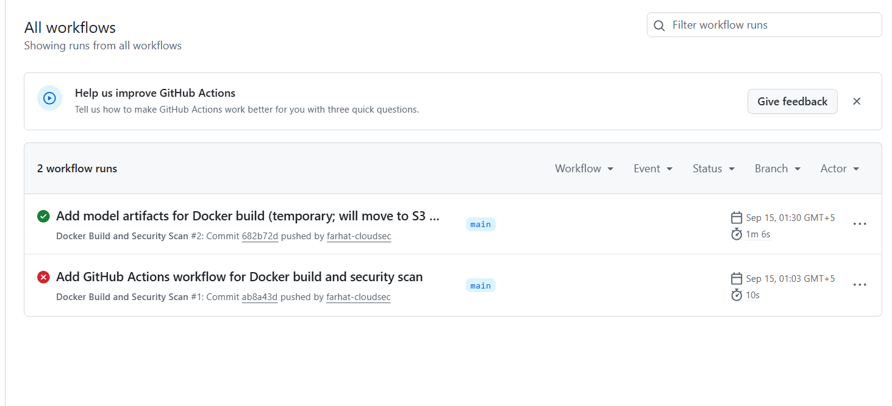
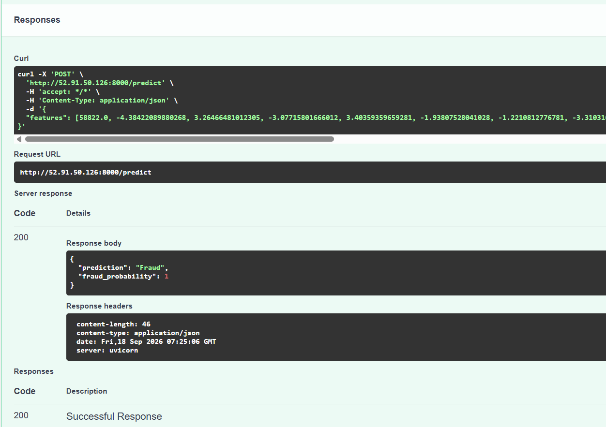

# Secure DevSecOps Credit Fraud Detection Pipeline

An end-to-end, security-focused MLOps pipeline for credit card fraud detection — covering model training, experiment tracking, API deployment, containerization, CI/CD with automated security scanning, cloud deployment, and model monitoring.

## Overview

This project demonstrates a complete DevSecOps workflow for deploying a machine learning model to production, with an emphasis on security best practices at every stage.

**Pipeline flow:**

## Tech Stack

- **Language:** Python
- **ML:** scikit-learn, MLflow (experiment tracking)
- **API:** FastAPI
- **Containerization:** Docker
- **CI/CD:** GitHub Actions
- **Security Scanning:** Trivy (vulnerability scanning in CI pipeline)
- **Cloud:** AWS (EC2, ECR, IAM)
- **Monitoring:** Statistical drift detection (Kolmogorov-Smirnov test)

## Features

- **Fraud Detection Model:** Logistic Regression classifier trained on the industry-standard credit card fraud dataset, with class-imbalance handling (`class_weight='balanced'`).
- **Experiment Tracking:** All training runs, parameters, and metrics (precision, recall, F1) are logged with MLflow for reproducibility and comparison.
- **REST API:** Model is served via a FastAPI `/predict` endpoint with a Pydantic-validated request schema. Interactive API docs available at `/docs`.
- **Containerization:** Application is packaged into a Docker image with a minimal base image for a smaller attack surface.
- **CI/CD Pipeline:** Every push to `main` triggers an automated GitHub Actions workflow that builds the Docker image and scans it with **Trivy** for known vulnerabilities (CRITICAL/HIGH severity).
- **Cloud Deployment:** The Docker image is pushed to **AWS ECR** and deployed on an **AWS EC2** instance, secured with a least-privilege IAM role and a Security Group restricted to specific IPs.
- **Model Monitoring:** A Kolmogorov-Smirnov statistical test compares feature distributions between training and test data to detect data drift, with a visual drift-report dashboard (see below).

## Drift Detection Dashboard



The dashboard shows the proportion of features with statistically significant drift (p < 0.05) between the training and test splits, helping identify when a model may need retraining in production.

## Screenshots

**MLflow Experiment Tracking**


**API Documentation (Swagger UI)**


**CI/CD Pipeline — Passing Build**


**Live Prediction Test (Deployed on AWS EC2)**


## Project Structure
├── data/ # Dataset (not tracked in git)
├── notebooks/
│ └── eda.ipynb # Data exploration, model training, MLflow logging, drift analysis
├── src/
│ ├── api/
│ │ └── main.py # FastAPI application
│ └── mode/ # Trained model artifacts (.pkl)
├── .github/workflows/
│ └── docker-build.yml # CI/CD pipeline (build + security scan)
├── dockerfile
├── requirements.txt
└── README.md

## Running Locally

```bash
# Set up environment
python -m venv venv
venv\Scripts\activate
pip install -r requirements.txt

# Run the API
cd src/api
uvicorn main:app --reload
```

Visit `http://127.0.0.1:8000/docs` to test the `/predict` endpoint.

## Running with Docker

```bash
docker build -t fraud-detection-api .
docker run -d -p 8000:8000 fraud-detection-api
```

## Notes on Design Decisions

- **Model artifacts** are currently version-controlled in this repository for simplicity. In a production setup, these would be stored in a dedicated model registry (e.g., MLflow Model Registry or an S3 bucket) rather than in git.
- **Least-privilege IAM** and **IP-restricted security groups** were used throughout the AWS deployment to minimize the attack surface.
- A baseline **Logistic Regression** model was used to prioritize building the full secure deployment pipeline; the pipeline is designed to support additional model comparisons in the future.

## Author

Farhat Iqbal — [LinkedIn](https://www.linkedin.com/in/farhat-iqbal)